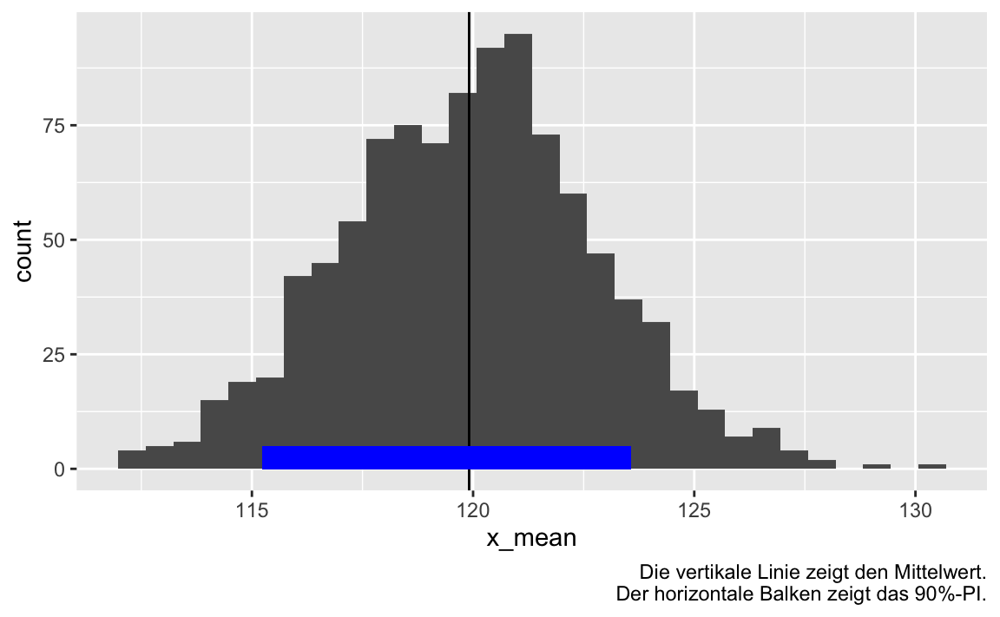

# Vorbereitung


```r
library(tidyverse)  # Datenjudo
library(infer)  # Inferenzstatistik
```


# Kann man wirklich von einer Stichprobe auf eine Grundgesamtheit schließen?


Alle Welt behauptet, dass man von einer Stichprobe auf eine Grundgesamtheit schließen könne.
Aber stimmt das wirklich? Welcher von den Profs, 
die das tagaus, tagein gebetsmühlenartig von sich geben,
hat das eigentlich bewiesen?

Tja.

Probieren wir es einfach aus.


# Hier ist eine Population


Wir definieren uns eine Population bzw. eine Verteilung für eine Variable.

Sagen wir, um es konkret zu machen,
uns interessiert die Zeit, die mittelfränkisch junge Erwachsene pro Tag am Handy verbringen (im Schnitt).
Um uns Tipperei zu sparen, 
geben wir dieser Variablen den Namen $X$.


Sagen wir weiter, wir würden die die Handy-Daddel-Zeiten aller Menschen minütiös nachverfolgen und kennen also die wahre Daddelzeit, $X$.

Sagen wir, um die Sache einfach zu halten, $X$ ist normalverteilt mit Mittelwert 120 und Streuung 20 (in Minuten):

$$X \sim \mathcal{N}(\mu = 120,\sigma = 20)$$.


Auf dieser Basis "erzeugen" wir uns die täglichen mittleren Daddelzeiten. Sagen wir, die Population umfasse $n=10^6$ Personen.


```r
set.seed(42)  # Zufallszahlen festlegen
d <- tibble(
  x = rnorm(1e6, mean = 120, sd = 20)
)
```


# Wir ziehen eine Stichprobe

Wir ziehen eine Stichprobe (sample, `smple`),
sagen wir der Größe $n=50$:


```r
smple <- 
  d %>% 
  sample_n(size = 50)
```


```r
smple %>% 
  summarise(x_mean = mean(x),
            x_sd = sd(x))
#> # A tibble: 1 × 2
#>   x_mean  x_sd
#>    <dbl> <dbl>
#> 1   122.  18.3
```

Ah! Unsere Stichprobe gibt die Population (synonym: Grundgesamtheit ordentlich wieder).


# Moment

Halt, könnten Sie jetzt sagen.
Das war ja bestimmt nur Zufall. Glück gehabt. Blindes Huhn und so weiter.

# Also gut, ziehen wir viele Stichproben

Um uns zu überzeugen,
ob es sich um einen Zufallsbefund gehandelt hat oder nicht,
ziehen wir also viele (sagen wir, $k=1000$) Stichproben (mit Zurücklegen) aus der Population und schauen uns dann deren Mittelwerte und Streuungen an.
Dann werden wir sehen,
ob die Stichproben überwiegend die Population gut wiedergeben bzw.
wie eng die Stichproben-Mittelwerte um den wahren Populationsparameter,
also dem Mittelwert der Population, herum streuen.

Dazu hilft uns das Paket `infer`:


```r
library(infer)
```

Mit `rep_sample_n()` könnenn wir viele Stichproben ziehen:


```r
set.seed(42)
viele_stipros <-
  d %>% 
  rep_sample_n(size = 50,
               replace = TRUE,
               reps = 1000)

head(viele_stipros)
#> # A tibble: 6 × 2
#> # Groups:   replicate [1]
#>   replicate     x
#>       <int> <dbl>
#> 1         1 156. 
#> 2         1 153. 
#> 3         1 117. 
#> 4         1 135. 
#> 5         1 132. 
#> 6         1  95.9
```

Ach ja, das Schließen von einer Stichprobe auf eine Grundgesamtheit nennt man

~~Interferenzstatistik~~, ~~Inderfernestatistik~~ -- schließende Statistik oder *Inferenzstatistik*.

# Zusammenfassen der Stichproben


```r
viele_stipros_zfsg <- 
  viele_stipros %>%
  group_by(replicate) %>% 
  summarise(x_mean = mean(x),
            x_sd = sd(x))

head(viele_stipros_zfsg)
#> # A tibble: 6 × 3
#>   replicate x_mean  x_sd
#>       <int>  <dbl> <dbl>
#> 1         1   122.  17.2
#> 2         2   121.  22.3
#> 3         3   120.  19.1
#> 4         4   121.  20.0
#> 5         5   122.  18.3
#> 6         6   124.  18.6
```


Ein paar Statistiken:


```r
viele_stipros_zfsg %>% 
  summarise(mu_dach = mean(x_mean),
            sigma_dach = mean(x_sd),
            q05 = quantile(x_mean, .05),
            q95 = quantile(x_mean, .90))
#> # A tibble: 1 × 4
#>   mu_dach sigma_dach   q05   q95
#>     <dbl>      <dbl> <dbl> <dbl>
#> 1    120.       19.9  115.  124.
```


# Visualisierung


```r
viele_stipros_zfsg %>% 
  ggplot(aes(x = x_mean)) +
  geom_histogram() +
  geom_vline(xintercept = 119.91) +
   geom_rect(xmin = 115.23, xmax = 123.57, 
            ymin = 0, ymax = 5,
            fill = "blue",
            alpha = .5) +
  labs(caption = "Die vertikale Linie zeigt den Mittelwert.\nDer horizontale Balken zeigt das 90%-PI.")
```




# Fazit

Hey, das Zeug scheint zu klappen!

Das könnte auch der Grund sein,
warum ein Koch einfach nur einen kleinen Löffel seiner Supper abschmeckt (nachdem er gut umgerüht hat),
und nicht eine "Vollerhebung" seiner Supper machen muss,
um sich zu vergewissern, dass sie gut schmeckt.


# Reproduzierbarkeit


```
#> ─ Session info ───────────────────────────────────────────────────────────────────────────────────────────────────────
#>  setting  value                       
#>  version  R version 4.1.3 (2022-03-10)
#>  os       macOS Big Sur/Monterey 10.16
#>  system   x86_64, darwin17.0          
#>  ui       X11                         
#>  language (EN)                        
#>  collate  en_US.UTF-8                 
#>  ctype    en_US.UTF-8                 
#>  tz       Europe/Berlin               
#>  date     2022-03-28                  
#> 
#> ─ Packages ───────────────────────────────────────────────────────────────────────────────────────────────────────────
#>  package     * version date       lib source                            
#>  assertthat    0.2.1   2019-03-21 [1] CRAN (R 4.1.0)                    
#>  backports     1.4.1   2021-12-13 [1] CRAN (R 4.1.0)                    
#>  blogdown      1.8     2022-02-16 [2] CRAN (R 4.1.2)                    
#>  bookdown      0.24.2  2021-10-15 [1] Github (rstudio/bookdown@ba51c26) 
#>  brio          1.1.3   2021-11-30 [1] CRAN (R 4.1.0)                    
#>  broom         0.7.12  2022-01-28 [1] CRAN (R 4.1.2)                    
#>  bslib         0.3.1   2021-10-06 [1] CRAN (R 4.1.0)                    
#>  cachem        1.0.6   2021-08-19 [1] CRAN (R 4.1.0)                    
#>  callr         3.7.0   2021-04-20 [1] CRAN (R 4.1.0)                    
#>  cellranger    1.1.0   2016-07-27 [1] CRAN (R 4.1.0)                    
#>  cli           3.2.0   2022-02-14 [1] CRAN (R 4.1.2)                    
#>  codetools     0.2-18  2020-11-04 [2] CRAN (R 4.1.3)                    
#>  colorout    * 1.2-2   2022-01-04 [1] Github (jalvesaq/colorout@79931fd)
#>  colorspace    2.0-3   2022-02-21 [1] CRAN (R 4.1.2)                    
#>  crayon        1.5.0   2022-02-14 [1] CRAN (R 4.1.2)                    
#>  DBI           1.1.2   2021-12-20 [1] CRAN (R 4.1.0)                    
#>  dbplyr        2.1.1   2021-04-06 [1] CRAN (R 4.1.0)                    
#>  desc          1.4.0   2021-09-28 [1] CRAN (R 4.1.0)                    
#>  devtools      2.4.3   2021-11-30 [1] CRAN (R 4.1.0)                    
#>  digest        0.6.29  2021-12-01 [1] CRAN (R 4.1.0)                    
#>  dplyr       * 1.0.8   2022-02-08 [1] CRAN (R 4.1.2)                    
#>  ellipsis      0.3.2   2021-04-29 [1] CRAN (R 4.1.0)                    
#>  evaluate      0.14    2019-05-28 [1] CRAN (R 4.1.0)                    
#>  fansi         1.0.2   2022-01-14 [1] CRAN (R 4.1.2)                    
#>  farver        2.1.0   2021-02-28 [1] CRAN (R 4.1.0)                    
#>  fastmap       1.1.0   2021-01-25 [2] CRAN (R 4.1.0)                    
#>  forcats     * 0.5.1   2021-01-27 [1] CRAN (R 4.1.0)                    
#>  fs            1.5.2   2021-12-08 [1] CRAN (R 4.1.0)                    
#>  generics      0.1.2   2022-01-31 [1] CRAN (R 4.1.2)                    
#>  ggplot2     * 3.3.5   2021-06-25 [2] CRAN (R 4.1.0)                    
#>  glue          1.6.2   2022-02-24 [1] CRAN (R 4.1.2)                    
#>  gtable        0.3.0   2019-03-25 [1] CRAN (R 4.1.0)                    
#>  haven         2.4.3   2021-08-04 [1] CRAN (R 4.1.0)                    
#>  highr         0.9     2021-04-16 [1] CRAN (R 4.1.0)                    
#>  hms           1.1.1   2021-09-26 [1] CRAN (R 4.1.0)                    
#>  htmltools     0.5.2   2021-08-25 [1] CRAN (R 4.1.0)                    
#>  httr          1.4.2   2020-07-20 [1] CRAN (R 4.1.0)                    
#>  infer       * 1.0.0   2021-08-13 [1] CRAN (R 4.1.0)                    
#>  jquerylib     0.1.4   2021-04-26 [1] CRAN (R 4.1.0)                    
#>  jsonlite      1.7.3   2022-01-17 [1] CRAN (R 4.1.2)                    
#>  knitr         1.37    2021-12-16 [1] CRAN (R 4.1.0)                    
#>  labeling      0.4.2   2020-10-20 [1] CRAN (R 4.1.0)                    
#>  lifecycle     1.0.1   2021-09-24 [1] CRAN (R 4.1.0)                    
#>  lubridate     1.8.0   2021-10-07 [1] CRAN (R 4.1.0)                    
#>  magrittr      2.0.2   2022-01-26 [1] CRAN (R 4.1.2)                    
#>  memoise       2.0.0   2021-01-26 [2] CRAN (R 4.1.0)                    
#>  modelr        0.1.8   2020-05-19 [1] CRAN (R 4.1.0)                    
#>  munsell       0.5.0   2018-06-12 [1] CRAN (R 4.1.0)                    
#>  pillar        1.7.0   2022-02-01 [1] CRAN (R 4.1.2)                    
#>  pkgbuild      1.2.0   2020-12-15 [2] CRAN (R 4.1.0)                    
#>  pkgconfig     2.0.3   2019-09-22 [1] CRAN (R 4.1.0)                    
#>  pkgload       1.2.4   2021-11-30 [1] CRAN (R 4.1.0)                    
#>  prettyunits   1.1.1   2020-01-24 [1] CRAN (R 4.1.0)                    
#>  processx      3.5.2   2021-04-30 [1] CRAN (R 4.1.0)                    
#>  ps            1.6.0   2021-02-28 [1] CRAN (R 4.1.0)                    
#>  purrr       * 0.3.4   2020-04-17 [1] CRAN (R 4.1.0)                    
#>  R6            2.5.1   2021-08-19 [1] CRAN (R 4.1.0)                    
#>  Rcpp          1.0.8   2022-01-13 [1] CRAN (R 4.1.2)                    
#>  readr       * 2.1.2   2022-01-30 [1] CRAN (R 4.1.2)                    
#>  readxl        1.3.1   2019-03-13 [1] CRAN (R 4.1.0)                    
#>  remotes       2.4.0   2021-06-02 [2] CRAN (R 4.1.0)                    
#>  reprex        2.0.1   2021-08-05 [1] CRAN (R 4.1.0)                    
#>  rlang         1.0.2   2022-03-04 [1] CRAN (R 4.1.2)                    
#>  rmarkdown     2.11    2021-09-14 [1] CRAN (R 4.1.0)                    
#>  rprojroot     2.0.2   2020-11-15 [2] CRAN (R 4.1.0)                    
#>  rstudioapi    0.13    2020-11-12 [1] CRAN (R 4.1.0)                    
#>  rvest         1.0.2   2021-10-16 [1] CRAN (R 4.1.0)                    
#>  sass          0.4.0   2021-05-12 [1] CRAN (R 4.1.0)                    
#>  scales        1.1.1   2020-05-11 [1] CRAN (R 4.1.0)                    
#>  sessioninfo   1.1.1   2018-11-05 [2] CRAN (R 4.1.0)                    
#>  stringi       1.7.6   2021-11-29 [1] CRAN (R 4.1.0)                    
#>  stringr     * 1.4.0   2019-02-10 [1] CRAN (R 4.1.0)                    
#>  testthat      3.1.2   2022-01-20 [1] CRAN (R 4.1.2)                    
#>  tibble      * 3.1.6   2021-11-07 [1] CRAN (R 4.1.0)                    
#>  tidyr       * 1.2.0   2022-02-01 [1] CRAN (R 4.1.2)                    
#>  tidyselect    1.1.2   2022-02-21 [1] CRAN (R 4.1.2)                    
#>  tidyverse   * 1.3.1   2021-04-15 [1] CRAN (R 4.1.0)                    
#>  tzdb          0.1.2   2021-07-20 [2] CRAN (R 4.1.0)                    
#>  usethis       2.0.1   2021-02-10 [2] CRAN (R 4.1.0)                    
#>  utf8          1.2.2   2021-07-24 [1] CRAN (R 4.1.0)                    
#>  vctrs         0.3.8   2021-04-29 [1] CRAN (R 4.1.0)                    
#>  withr         2.5.0   2022-03-03 [1] CRAN (R 4.1.2)                    
#>  xfun          0.29    2021-12-14 [1] CRAN (R 4.1.0)                    
#>  xml2          1.3.3   2021-11-30 [1] CRAN (R 4.1.0)                    
#>  yaml          2.2.2   2022-01-25 [1] CRAN (R 4.1.2)                    
#> 
#> [1] /Users/sebastiansaueruser/Library/R/x86_64/4.1/library
#> [2] /Library/Frameworks/R.framework/Versions/4.1/Resources/library
```


