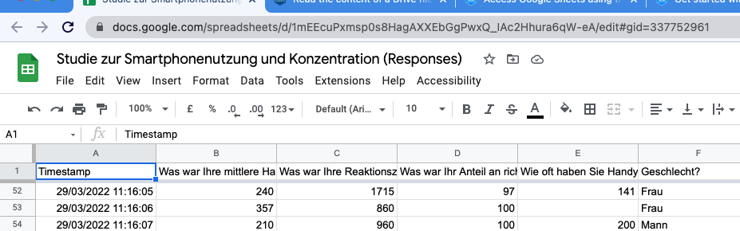

```{r knitr-setup, echo = FALSE}
knitr::opts_chunk$set(
  comment = "#>",
  collapse = TRUE,
  message = FALSE,
  warning = FALSE,
  cache = TRUE,
  out.width = "100%",
  fig.align = 'center',
  fig.width = 6,
  fig.asp = 0.618,  # 1 / phi
  fig.show = "hold",
  size = "tiny",
  echo = TRUE
)
```


# Load packages

```{r load-libs, message = FALSE, warning = FALSE}
library(tidyverse)  # data wrangling
library(googlesheets4)  # GSheets API
library(gt)  # html tables
```


# Motivation

Data sharing is of primary concern for science and, increasingly, technology.
Whereas there are specialized repositories for data storage and exchange (which are very useful),
at times more quick and dirty solutions are desirable.
This is what we are looking at in this post:
Using GoogleSheets for quick data access.


# Find your GoogleSheets File

You need the URL (or the id) of you GSheets file.
Go locate it,
see the example below:

```{r img-1}

```


Here's the sheet's URL:

```{r url}
sheet_url <- "https://docs.google.com/spreadsheets/d/1mEEcuPxmsp0s8HagAXXEbGgPwxQ_IAc2Hhura6qW-eA/edit?usp=sharing"
```


# Authentificate

First step (after starting the package(s)) is to authentificate:

```{r auth, eval = FALSE}
gs4_deauth()
```

You'll be directed to a Google Login page. Use your Google credentials to sign-in.

(Note that this approach only works in an interactive session, where the
Google credentials are handed over by the user's sign-in approval.)

Here we are assuming that the the sheet is freely accessible.


# Read it

Use the following function in an interactive session:

```{r import, eval = FALSE}
d <- read_sheet(sheet_url)
```

Yielding this result:

`
✓ Reading from "Studie zur Smartphonenutzung und Konzentration (Responses)".
✓ Range Form responses 1.
`


```{r import-local, echo = FALSE}
#write_csv(d, file = "gsheet-concentration.csv")
d <- read_csv("gsheet-concentration.csv")
```


# Check


```{r}
d %>% 
  head() %>% 
  gt()
```

```{r}
d %>% 
  glimpse()
```


# Rename

```{r}
names(d) <- c("Timestamp", "usage_time", "rt", "correct_prop", "pickups_n", "sex")
```


# Some caveats

If the columns are not pure numbers,
then the columns will be parsed as lists,
which is more difficult to process afterwards.
For that reason, it is preferable to force pure number responses in the form,
where applicable.


# Reproducibility

```{r reproducibility, echo = FALSE}
## Reproducibility info
options(width = 120)
devtools::session_info()

```


